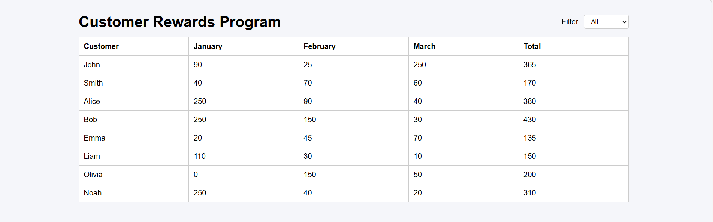
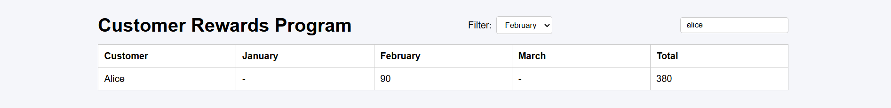
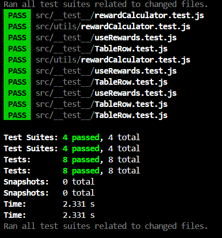

Overview

The Customer Rewards Program is a React-based application that calculates and displays reward points earned by customers based on their transactions.

The reward points are calculated as follows:

2 points for every dollar spent over $100

1 point for every dollar spent between $50 and $100

The application provides a filterable table that allows users to view rewards by month or see all months at once.

Features

Dynamic Rewards Calculation

Fetches transactions data from a simulated API.

Calculates monthly and total reward points per customer using calculateRewardPoints.

Automatically updates when new data is added.

Filter Controls

Dropdown filter to view All months or a specific month.

Integrates with the table to show relevant data only.

Responsive Rewards Table

Displays customer name, points per month, and total points.

Updates dynamically based on selected filter Or Search.

Reusable Components

FilterControls for dropdown filters.

TableRow for rendering each customer's row in the table.

Test Coverage

Unit tests for reward calculation logic using Jest.

Validates edge cases such as amounts ≤50, 50-100, and >100.

## App screenshots

## Test cases screenshots

